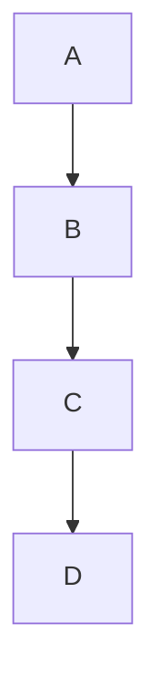

# Spectre System

The spectre system is a computing platform that is built from first principles.
Minimalism, user-centric, efficiency and scalablility are philosophies I like.

Sure, you don't need to be $100\%$ efficient, but even $97\%$ is much much better than $40\%$ or even $70\%$. Especially for devices we carry on us and use as supplementing tools. For high end servers and computing racks, the philosophy changes somewhat.

The spectre hardware design involves a set of compute units such as a minimalist SoC and interconnect system. We rely more on wireless connectivity through 2.4-5GHz connections for peripherals such as mice and keyboards, headsets and displays. Charging is done through magnetised thunderbolt 5. Other peripherals such as 2FA keys and crypto keys are accomplished through NFC.

## Spectre-U

Spectre User is the user optimised configuration of the spectre system.

## Spectre-S

Spectre Server is the high end optimised configuration of the spectre system. Instead of focusing on efficiency, heat generation, etc. We mainly focus on scalability and the highest performance possible.

